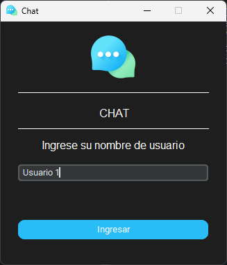
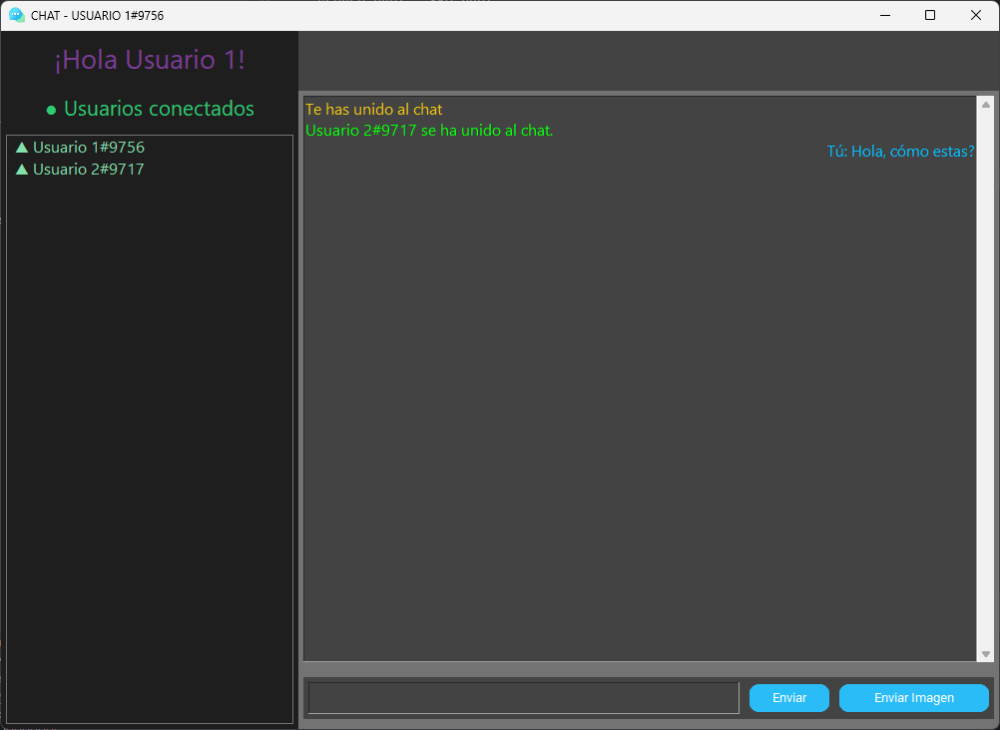
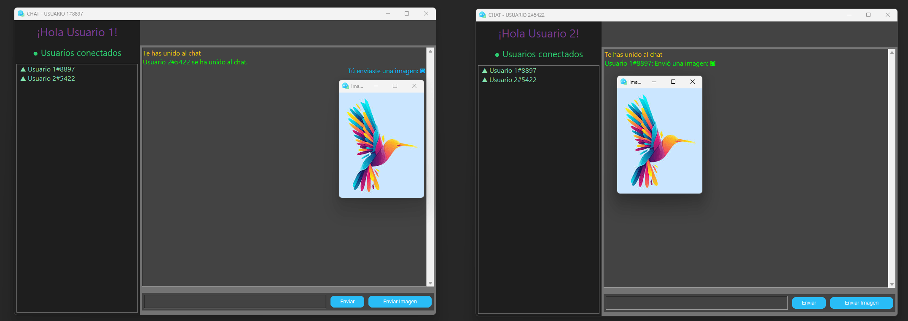
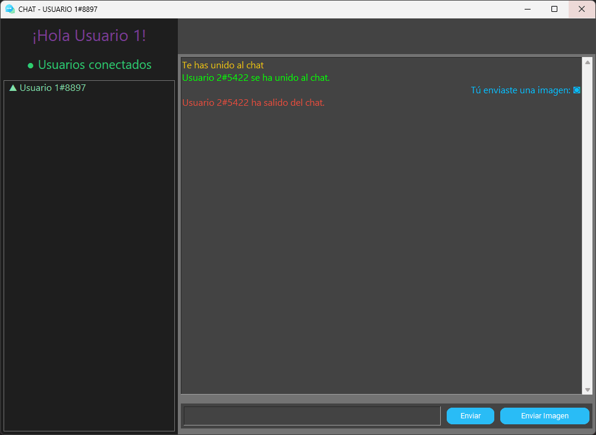
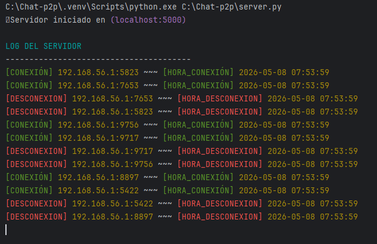

# 💬 Chat P2P

Una aplicación de **chat en tiempo real con arquitectura peer-to-peer (P2P)**, desarrollada en Python con interfaz gráfica moderna. Los mensajes y archivos se transmiten con **cifrado de extremo a extremo** usando el algoritmo Fernet (AES-128).

---

## 🏗️ Arquitectura

```
┌─────────────┐  REGISTER  ┌─────────────────────────────┐
│             │◄──────────►│   Servidor de Registro      │
│  Cliente A  │            │      (Server.py)            │
│             │            │  – Mantiene lista de peers  │
└──────┬──────┘            └─────────────────────────────┘
       │  P2P directo (TCP sockets, cifrado E2E)
┌──────▼──────┐
│  Cliente B  │
└─────────────┘
```

El servidor actúa únicamente como **directorio de peers** (Discovery Server). Una vez que los nodos se registran y obtienen la lista de peers activos, la comunicación ocurre **directamente entre clientes** sin pasar por el servidor.

---

## ✨ Características

- 🔒 **Cifrado E2E** — Todos los mensajes se cifran con Fernet (AES-128-CBC + HMAC)
- 👥 **Multiusuario** — Soporte para múltiples peers simultáneos en la misma sala
- 🖼️ **Envío de imágenes** — Transferencia de archivos `.png`, `.jpg`, `.jpeg`, `.gif`
- 🔔 **Notificaciones** — Alertas cuando un usuario entra o sale del chat
- 🎨 **Interfaz gráfica** — UI oscura con `tkinter` + `customtkinter`
- 🧵 **Concurrencia** — Cada conexión P2P se maneja en un hilo independiente
- 🎲 **Puerto dinámico** — Cada cliente escoge un puerto aleatorio (5000–9999)

---

## 📸 Interfaz

### Ventana de Login



### Ventana de Chat



### Envío de imágenes



### Notificación de desconexión



### Colores de mensajes

| Color | Significado |
|---|---|
| 🟢 Verde | Mensajes de otros usuarios |
| 🔵 Azul | Tus propios mensajes |
| 🟡 Amarillo | Notificación de nuevo usuario |
| 🔴 Rojo | Notificación de usuario desconectado |

### Consola del Servidor



---

## 🔐 Seguridad

La comunicación está protegida con **cifrado simétrico Fernet**, que garantiza:
- **Confidencialidad** — Los mensajes no pueden leerse sin la clave.
- **Integridad** — Cualquier modificación en tránsito es detectada (HMAC-SHA256).
- **Autenticidad** — Los datos provienen del remitente legítimo.

> La clave en `config/env.py` es una pre-shared key. Para producción, se recomienda implementar un esquema de intercambio de claves más robusto (e.g., Diffie-Hellman).

---

## 📁 Estructura del Proyecto

```
Chat-p2p/
├── run.py              # Punto de entrada del cliente
├── server.py           # Servidor de registro (Discovery Server)
├── crypto.py           # Módulo de cifrado compartido (cliente + servidor)
├── requirements.txt    # Dependencias del proyecto
│
├── chat/               # Paquete del cliente P2P
│   ├── __init__.py
│   ├── main.py         # Inicialización: conecta red y GUI
│   ├── network.py      # Lógica de red P2P (ChatNetwork)
│   └── gui.py          # Interfaz gráfica (ChatGUI)
│
├── config/             # Paquete de configuración
│   ├── __init__.py
│   ├── config.py       # Constantes: colores, fuentes, tamaños de ventana
│   ├── env.py          # Variables de entorno: HOST, PORT, KEY
│   └── colors.py       # Colores ANSI para la consola del servidor
│
└── images/
    └── logo.png        # Ícono de la aplicación
```

---

## 🛠️ Instalación

### Requisitos

- Python **3.10+**
- Las siguientes dependencias de terceros:

| Librería | Uso |
|---|---|
| `customtkinter` | Widgets modernos para la GUI |
| `cryptography` | Cifrado Fernet (AES-128-CBC + HMAC-SHA256) |
| `Pillow` | Visualización de imágenes en el chat |
| `tkinter` | Framework base de la UI *(incluido en Python)* |

### Pasos

```bash
# 1. Clona el repositorio
git clone https://github.com/FernandoRuiz87/Chat-p2p.git
cd Chat-p2p

# 2. (Recomendado) Crea un entorno virtual
python -m venv .venv
.venv\Scripts\activate      # Windows
# source .venv/bin/activate # Linux / macOS

# 3. Instala las dependencias
pip install -r requirements.txt
```

---

## 🚀 Uso

### 1. Iniciar el servidor de registro

El servidor debe estar corriendo **antes** de que cualquier cliente intente conectarse.

```bash
python server.py
```

El servidor escuchará en `localhost:5000` de forma predeterminada y mostrará un log de conexiones/desconexiones en tiempo real.

### 2. Iniciar uno o más clientes

Abre una terminal por cada usuario que quieras conectar (siempre desde la raíz del proyecto):

```bash
python run.py
```

Al iniciar, el cliente:
1. Se conecta al servidor de registro.
2. Muestra una ventana de login para ingresar el nombre de usuario.
3. Se registra y recibe la lista de peers activos.
4. Establece conexiones directas P2P con todos los peers.
5. Abre la ventana del chat.

---

## ⚙️ Configuración (`config/env.py`)

| Variable | Valor por defecto | Descripción |
|---|---|---|
| `HOST` | `localhost` | Dirección del servidor de registro |
| `PORT` | `8000` | Puerto del servidor de registro |
| `KEY` | *(Fernet key)* | Clave simétrica de cifrado compartida |

> **⚠️ Importante:** Todos los clientes y el servidor deben usar la misma `KEY`. Para desplegar en red local o remota, cambia `HOST` a la IP de la máquina que ejecuta el servidor.